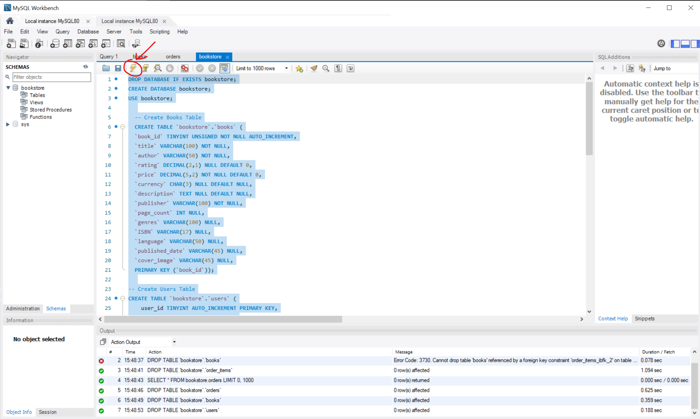
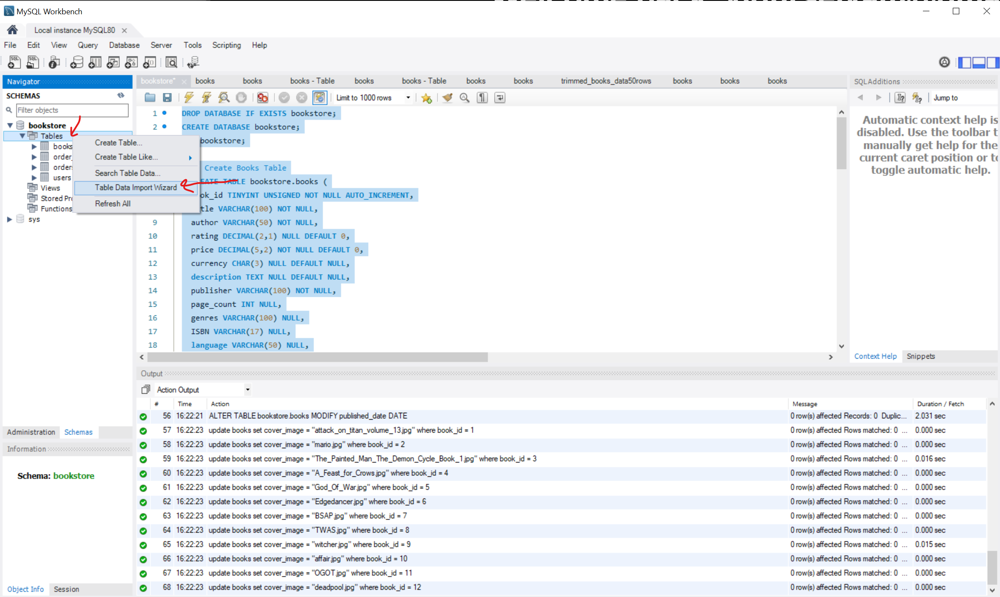

# INF2003-Team-49
Database Systems Project

## Downloading MySQL Server and Workbench
Download MySQL installer here: https://dev.mysql.com/downloads/installer/.

1. Run MySQL installer

2. Choose Full Setup type

   

3. Click 'execute' to install all products.

4. Configure MySQL Server (if you have MariaDB installed, its most likely running on port 3306. Change the port for your MySQL Server to another available port, e.g. 3307).

5. Use strong password authentication

6.  Set root user password (your own password)

7. Start MySQL Server at System Startup. Use Standard System Account. Apply configuration.

8. Use default configuration for other MySQL products.

9.  Check to see if can connect to server. If not check if password and username (default root) is correct.

10. Start MySQL workbench after setup.

## Setting up database

1. Click on `Local instance MySQL80` and enter password (take note which port your MySQL Server is running on).

2. In top left, under `File` tab, select `Open SQL script`. Open `bookstore.sql` (from github repo).

3. Highlight all text (Ctrl-A), and click the lightning button (circled in red).

4. Refresh the SCHEMAS on the left.

5. In the navigation pane, click `Schemas`. Make sure that `bookstore` has been created.

6. Refresh the SCHEMAS on the left.

7. Import table found in Github Repo named: trimmed_books_data50rows.csv. Steps:

## Running app.py

1. Make sure requirements are installed. If not, run `pip install -r requirements.txt`.

2. Run `python app.py`. Open web browser and go to `http://127.0.0.1:5000`.

